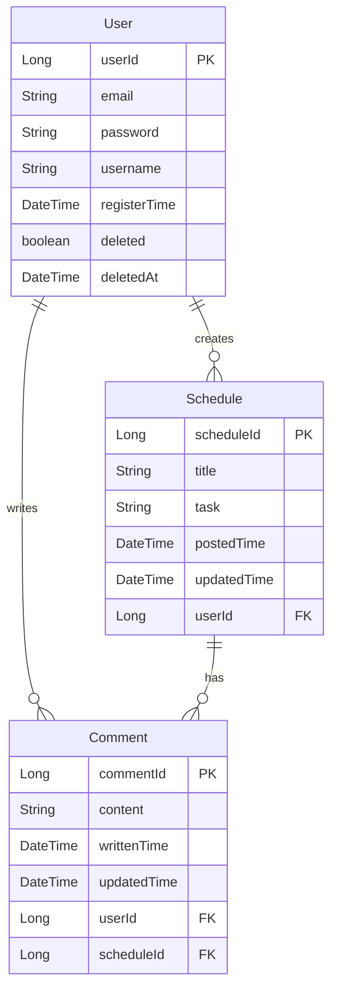

# 일정 관리 애플리케이션

## 개요
사용자 인증을 통해 개인화된 일정을 관리하고, 댓글을 통해 다른 사용자들과 소통할 수 있는 RESTful API 기반 일정 관리 시스템입니다.

<Hr>


## 기술 스택
- Java 17
- Spring Boot 3.4
- MySQL
- Spring Data JPA
- BCrypt (비밀번호 암호화)
- Lombok

<hr>

## ERD

<hr>

## API 명세

### 기본 정보
- 기본 URL: `/api`
- 응답 형식: JSON
- 문자 인코딩: UTF-8
- 인증: Session 기반

### API 목록

#### 사용자 관리
| Method | URI | Description | Request Body | Response |
|--------|-----|-------------|--------------|-----------|
| POST | /api/users/signup | 회원가입 | {email, password, username} | userId |
| POST | /api/users/login | 로그인 | {email, password} | userId |
| GET | /api/users/{id} | 사용자 정보 조회 | - | {id, email, username, registerTime} |
| PUT | /api/users/{id} | 사용자 정보 수정 | {email?, password?, username?} | - |
| DELETE | /api/users/{id} | 회원 탈퇴 | - | - |

#### 일정 관리
| Method | URI | Description | Request Body | Response |
|--------|-----|-------------|--------------|-----------|
| POST | /api/schedules | 일정 생성 | {title, task} | {title, task, username, postedTime, updatedTime} |
| GET | /api/schedules | 일정 목록 조회 | ?page=0&size=10 | {content: [{scheduleId, title, task, commentCount, username, postedTime, updatedTime}], pageable} |
| GET | /api/schedules/{id} | 일정 상세 조회 | - | {title, task, username, postedTime, updatedTime} |
| PUT | /api/schedules/{id} | 일정 수정 | {title, task} | {title, task, username, postedTime, updatedTime} |
| DELETE | /api/schedules/{id} | 일정 삭제 | - | - |

#### 댓글 관리
| Method | URI | Description | Request Body | Response |
|--------|-----|-------------|--------------|-----------|
| POST | /api/schedules/{scheduleId}/comments | 댓글 작성 | {content} | {commentId, content, username, writtenTime, updatedTime} |
| GET | /api/schedules/{scheduleId}/comments | 댓글 목록 조회 | - | [{commentId, content, username, writtenTime, updatedTime}] |
| PUT | /api/schedules/{scheduleId}/comments/{commentId} | 댓글 수정 | {content} | {commentId, content, username, writtenTime, updatedTime} |
| DELETE | /api/schedules/{scheduleId}/comments/{commentId} | 댓글 삭제 | - | - |

<hr>

# 요청/응답 본문 상세

## 요청 본문 상세

### 사용자 관리
#### 1. 회원가입 요청

>```json
>{
>    "username":"semin",
>    "email":"semin@semin.com",
>    "password":"semin123"
>}
>```

#### 2. 로그인 요청
>```json
>{
>    "email": "semin@semin.com",
>    "password": "semin123"
>}
>```

#### 3. 사용자 정보 수정 요청
>```json
>{
>    "email": "sungwoo@semin.com",
>    "password": "semin321",
>    "username": "sungwoo"
>}
>```

### 일정 관리
#### 1. 일정 생성 요청
>```json
>{
>    "title": "나는 내가",
>    "task": "빛나는 별인 줄 알았어요"
>}
>```

#### 2. 일정 수정 요청
>```json
>{
>    "title": "한 번도",
>    "task": "의심 한 적 없었죠"
>}
>```

### 댓글 관리
#### 1. 댓글 작성 요청
>```json
>{
>    "content": "몰랐어요"
>}
>```

#### 2. 댓글 수정 요청
>```json
>{
>    "content": "난 내가 벌레라는 것을"
>}
>```

## 응답 본문 상세

### 사용자 관리
#### 1. 회원가입/로그인 응답
>```json
>{
>    "userId": 1
>}
>```

#### 2. 사용자 정보 조회 응답
>```json
>{
>    "id": 1,
>    "email": "semin@semin.com",
>    "username": "semin123",
>    "registerTime": "2024-03-21T14:30:00"
>}
>```

### 일정 관리
#### 1. 일정 생성/수정 응답
>```json
>{
>    "title": "나는 내가",
>    "task": "빛나는 별인 줄 알았어요",
>    "username": "semin",
>    "postedTime": "2024-03-21T14:30:00",
>    "updatedTime": "2024-03-21T14:30:00"
>}
>```

#### 2. 일정 목록 조회 응답
>```json
>{
>    "content": [
>        {
>            "commentCount": 3,
>            "scheduleId": 1,
>            "title": "나는 내가",
>            "task": "빛나는 별인 줄 알았어요",
>            "username": "semin",
>            "postedTime": "2024-03-21T14:30:00",
>            "updatedTime": "2024-03-21T14:30:00"
>        }
>    ],
>    "pageable": {
>        "pageNumber": 0,
>        "pageSize": 10,
>        "totalElements": 1
>    }
>}
>```

### 댓글 관리
#### 1. 댓글 작성/수정 응답
>```json
>{
>    "commentId": 1,
>    "content": "몰랐어요",
>    "username": "semin",
>    "writtenTime": "2024-03-21T14:30:00",
>    "updatedTime": "2024-03-21T14:30:00"
>}
>```

#### 2. 댓글 목록 조회 응답
>```json
>[
>    {
>        "commentId": 1,
>        "content": "난 내가 벌레라는 것을",
>        "username": "semin",
>        "writtenTime": "2024-03-21T14:30:00",
>        "updatedTime": "2024-03-21T14:30:00"
>    }
>]
>```

<hr>

## 데이터베이스 스키마

>```sql
>CREATE DATABASE TaskManager;
>
>CREATE TABLE users (
>    user_id BIGINT AUTO_INCREMENT PRIMARY KEY,
>    email VARCHAR(100) UNIQUE NOT NULL,
>    password VARCHAR(100) NOT NULL,
>    username VARCHAR(50) NOT NULL,
>    register_time DATETIME NOT NULL,
>    deleted BOOLEAN DEFAULT FALSE,
>    deleted_at DATETIME
>);
>
>CREATE TABLE schedules (
>    schedule_id BIGINT AUTO_INCREMENT PRIMARY KEY,
>    title VARCHAR(100) NOT NULL,
>    task TEXT NOT NULL,
>    posted_time DATETIME NOT NULL,
>    updated_time DATETIME NOT NULL,
>    user_id BIGINT NOT NULL,
>    FOREIGN KEY (user_id) REFERENCES users(user_id)
>);
>
>CREATE TABLE comments (
>    comment_id BIGINT AUTO_INCREMENT PRIMARY KEY,
>    content TEXT NOT NULL,
>    written_time DATETIME NOT NULL,
>    updated_time DATETIME NOT NULL,
>    user_id BIGINT NOT NULL,
>    schedule_id BIGINT NOT NULL,
>    FOREIGN KEY (user_id) REFERENCES users(user_id),
>    FOREIGN KEY (schedule_id) REFERENCES schedules(schedule_id)
>);
>```
<hr>

## 주요 기능
>- 사용자 인증/인가 (회원가입, 로그인)
>- 일정 CRUD 작업
>- 댓글 CRUD 작업
>- 페이지네이션을 통한 일정 목록 조회
>- 소프트 삭제 (사용자)
>- N+1 문제 해결을 위한 fetch join 사용

<hr>

## 오류 처리
| 상태 코드 | 설명 | 응답 메시지 예시 |
|-----------|------|-----------------|
| 400 | 잘못된 요청 | "로그인이 필요합니다" |
| 403 | 권한 없음 | "수정 권한이 없습니다" |
| 404 | 리소스 없음 | "해당 일정이 존재하지 않습니다" |
| 500 | 서버 오류 | "서버 오류가 발생했습니다" |
